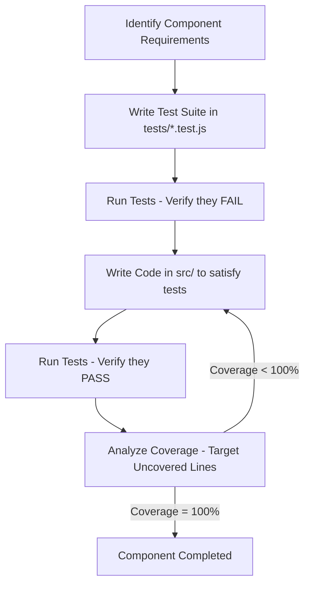

# ORIGINAL PLAN: Premium Website Blocker Chrome Extension (MV3)

This document outlines the detailed architectural blueprint, user experience design, technology selection, and execution roadmap for building a state-of-the-art Chrome Extension for website blocking using Manifest V3.

---

## 1. Vision & Core Philosophy

The goal is to create a visually striking, highly secure, and extremely lightweight Chrome Extension that empowers users to block websites using regular expressions (regex).

### Key Principles:
*   **Zero Compromise on Performance**: Offload matching to the browser's native engine (`declarativeNetRequest` API) instead of parsing every page request in JavaScript.
*   **Frugal Permissions**: Run with the absolute minimum number of permissions possible. No general host permissions (`<all_urls>`) should be requested, maximizing trust, privacy, and speed.
*   **Wow-Factor UI/UX**: Provide a stunning, modern dark-themed user interface with fluent animations, glowing glassmorphic elements, and harmonious HSL color palettes.
*   **Quality & Safety via TDD**: Strict Test-Driven Development (TDD) using Mock environments to achieve maximum possible (100%) code coverage prior to shipping.

---

## 2. Technical Architecture & APIs

```mermaid
graph TD
    subgraph UI Layers (Frontend)
        A[Popup UI<br/>popup.html/css/js] -->|Save/Delete Regex| B[(chrome.storage.local)]
        C[Blocked Landing Page<br/>blocked.html/css/js]
    end
    
    subgraph Browser Engine (MV3 Core)
        B -->|Read/Sync Rules| D[Background Service Worker<br/>service_worker.js]
        D -->|Update Dynamic Rules| E[declarativeNetRequest API]
        E -->|Block & Redirect Request| C
    end
```

### 2.1 MV3 Declarative Net Request (DNR)
We will leverage Chrome’s native `chrome.declarativeNetRequest` API.
*   **Dynamic Rules**: Since users can add/remove regexes dynamically, we will use `chrome.declarativeNetRequest.updateDynamicRules()` to modify rules at runtime.
*   **Frugal Redirect Hack**: To pass the original blocked URL to our custom `blocked.html` landing page *without* needing extra permissions (like `"webNavigation"` or `"tabs"`), we will use dynamic `regexSubstitution` in our redirect rule action:
    ```javascript
    const redirectUrl = chrome.runtime.getURL("pages/blocked.html") + "?url=\\0";
    const rule = {
      id: ruleId,
      priority: 1,
      action: {
        type: "redirect",
        redirect: { regexSubstitution: redirectUrl }
      },
      condition: {
        regexFilter: userRegexPattern,
        resourceTypes: ["main_frame"] // Block only full page navigations to avoid breaking API subresources
      }
    };
    ```

### 2.2 Permissions Analysis
We will keep our permissions extremely frugal by requesting ONLY:
1.  `"declarativeNetRequest"`: To register blocking/redirection rules.
2.  `"storage"`: To persist user-defined regex patterns.

---

## 3. High-Fidelity UI/UX & Aesthetics

We will build a cohesive visual identity using curated HSL color schemes and premium styles.

### 3.1 Design System (Theming)
*   **Theme**: Cyberpunk Dark Slate / Neon Orange-Red glow.
*   **Typography**: `Outfit` or `Inter` imported from Google Fonts.
*   **Primary HSL Colors**:
    *   Background: `hsl(224, 25%, 12%)` (Deep slate)
    *   Card Overlay: `hsla(224, 25%, 20%, 0.6)` (Glassmorphism with backdrop-filter)
    *   Accent Glowing Red: `hsl(354, 85%, 56%)` (Warning / Blocked color)
    *   Accent Green: `hsl(142, 70%, 45%)` (Valid / Success color)

### 3.2 View 1: Management Popup (`popup.html`)
A sleek, interactive dashboard (width: `360px`, height: `520px`):
*   **Header**: Glassmorphic banner featuring an active rule counter and a glowing master toggle switch.
*   **Add Filter Box**: Input field with floating border, real-time regex validation using Chrome's native `chrome.declarativeNetRequest.isRegexSupported()`, and smooth feedback icons.
*   **Rule List**: Sleek cards with hover-reveal deletion triggers and list entry/exit transition animations.

### 3.3 View 2: Redirect Landing Page (`blocked.html`)
A premium full-screen page displayed when a website is blocked:
*   **Background**: Deep dark slate with pulsing radial glow warning gradients.
*   **Center Panel**: Floating glassmorphic container with high blur (`backdrop-filter: blur(16px)`).
*   **Visual Assets**: Glowing orange SVG warning shield.
*   **CTA Button**: Glassmorphic button with gradient hover and dynamic click ripples returning the user safely to history (`window.history.back()`).

---

## 4. Test-Driven Development (TDD) & Unit Testing Strategy

To ensure robust code and satisfy the requirement for maximum unit test coverage, we will implement a strict **TDD** strategy before writing any component logic.



### 4.1 Testing Stack & Configuration
*   **Testing Framework**: **Vitest**
    *   *Why*: Fast, modern, compatible with native ESM, and provides an out-of-the-box coverage report utility using `c8` or `istanbul`.
*   **Environment**: `jsdom` (to simulate the browser document, window, and DOM events for `popup.js` and `blocked.js`).
*   **Coverage Engine**: `@vitest/coverage-v8`
    *   *Requirement*: Test suite execution will enforce a threshold of **100% unit test coverage** (branches, lines, functions, and statements).

### 4.2 Chrome API Mock System (`tests/mocks/chrome.mock.js`)
Since the tests run in a Node/Node-like environment without extension APIs, we will create a comprehensive, modular Chrome API mock. It will accurately simulate behavior and trigger callbacks:
*   **Storage Mock**:
    ```javascript
    let store = {};
    global.chrome = {
      storage: {
        local: {
          get: vi.fn((keys, cb) => {
            const res = {};
            if (typeof keys === 'string') res[keys] = store[keys];
            else if (Array.isArray(keys)) keys.forEach(k => res[k] = store[k]);
            else res = { ...store };
            if (cb) cb(res);
            return Promise.resolve(res);
          }),
          set: vi.fn((data, cb) => {
            store = { ...store, ...data };
            if (cb) cb();
            return Promise.resolve();
          }),
          clear: vi.fn((cb) => {
            store = {};
            if (cb) cb();
            return Promise.resolve();
          })
        }
      },
      // ... Mocking declarativeNetRequest and runtime
    };
    ```
*   **DeclarativeNetRequest Mock**:
    *   Tracks dynamic rules in a local array.
    *   Simulates dynamic rules updates (`updateDynamicRules`) and rule retrieval (`getDynamicRules`).
    *   Provides mocks for `isRegexSupported({ regex, isCaseSensitive })` using V8's regex parser to simulate compatibility responses.
*   **Runtime Mock**:
    *   Mocks `chrome.runtime.getURL(path)` to return consistent local URLs (`chrome-extension://mock-id/` + path).

---

## 5. TDD Implementation Steps & Roadmap

The implementation follows a strict **TDD flow** (Tests must be created *first* in each phase):

### Phase 1: Infrastructure & Test Rig Setup
1.  **Project Initialization**: Create `package.json` with dependencies (`vitest`, `jsdom`, `@vitest/coverage-v8`).
2.  **Configuration**: Create `vitest.config.js` pointing to the JSDOM environment and setting up coverage threshold rules (100% threshold).
3.  **Mocking Harness**: Write the mock engine in `tests/mocks/chrome.mock.js`.

### Phase 2: Design Tokens & Base Markup [Planned Code Only]
1.  Write styling assets and visual HTML structural layouts (`popup.html` and `blocked.html`).

### Phase 3: Core Service Worker [TDD]
1.  **Test First**: Create `tests/background.test.js`.
    *   Define tests for service worker startup (`onInstalled`).
    *   Define tests for dynamic rules synchronization: should clear obsolete rules, should convert saved patterns into properly structured dynamic rules, should handle disabled master toggle by purging rules.
2.  **Verify Failure**: Run `npx vitest run tests/background.test.js` and verify all tests fail.
3.  **Implementation**: Write `src/background/service_worker.js` and iterate until all tests pass.
4.  **Coverage**: Verify `service_worker.js` reaches 100% coverage.

### Phase 4: Popup Management Controller [TDD]
1.  **Test First**: Create `tests/popup.test.js`.
    *   Define tests for loading saved regexes from storage on load.
    *   Define tests for real-time validation: valid RE2 expressions vs invalid expressions (e.g. unclosed parentheses).
    *   Define tests for adding new rules, checking that empty or duplicate entries are rejected.
    *   Define tests for deleting rules: clicking a delete button should invoke removal from storage and dynamic rules.
    *   Define tests for master toggle switch changes.
2.  **Verify Failure**: Run `npx vitest run tests/popup.test.js` and verify tests fail.
3.  **Implementation**: Write `src/popup/popup.js` to drive the DOM events in `popup.html`, iterating until all tests pass.
4.  **Coverage**: Verify 100% coverage.

### Phase 5: Blocked Landing Page Controller [TDD]
1.  **Test First**: Create `tests/blocked.test.js`.
    *   Define tests for parsing the redirect URL query parameters (e.g., `?url=https://example.com`).
    *   Define tests for displaying the sanitized blocked URL and matched pattern in the DOM.
    *   Define tests for the "Go Back" CTA: clicking it must invoke `history.back()`.
2.  **Verify Failure**: Run `npx vitest run tests/blocked.test.js` and verify tests fail.
3.  **Implementation**: Write `src/pages/blocked.js` to satisfy the mock DOM expectations.
4.  **Coverage**: Verify 100% coverage.

---

## 6. Verification & Automated Testing Plan

*   **Automated Verification**:
    *   `npm run test`: Executes the complete test suite.
    *   `npm run coverage`: Runs the complete test suite and enforces a strict `100%` coverage requirement across the entire codebase. Build pipelines or local verification will fail if coverage drops below this threshold.
*   **Manual Verification**: Load unpacked extension in Google Chrome Developer Mode (`chrome://extensions/`) and ensure actual physical behavior matches the unit-tested functionality.
